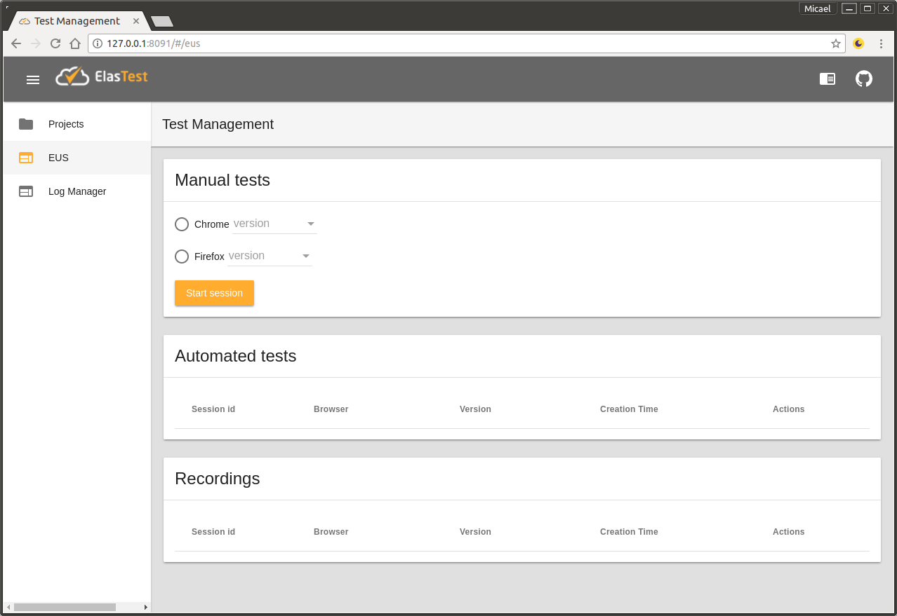
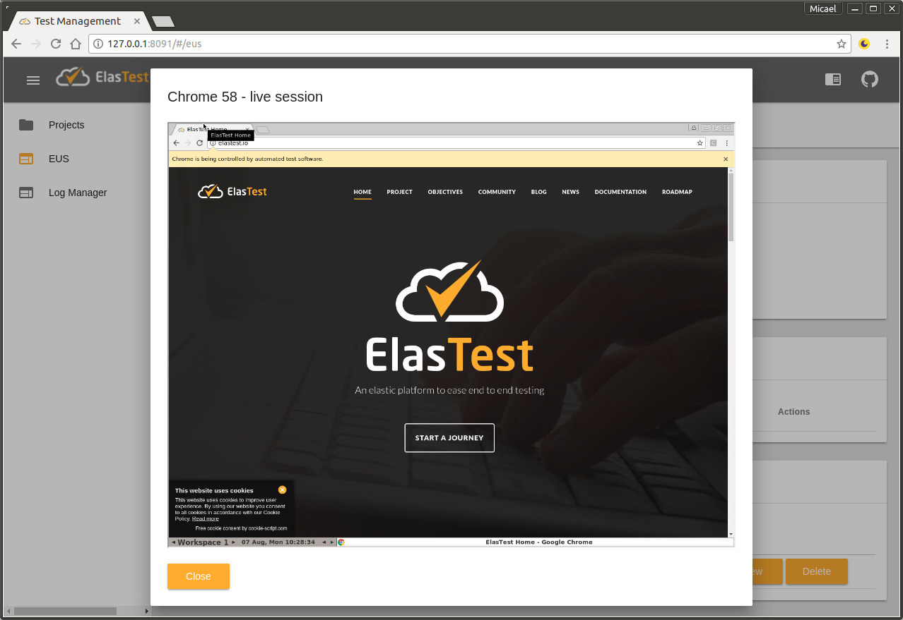
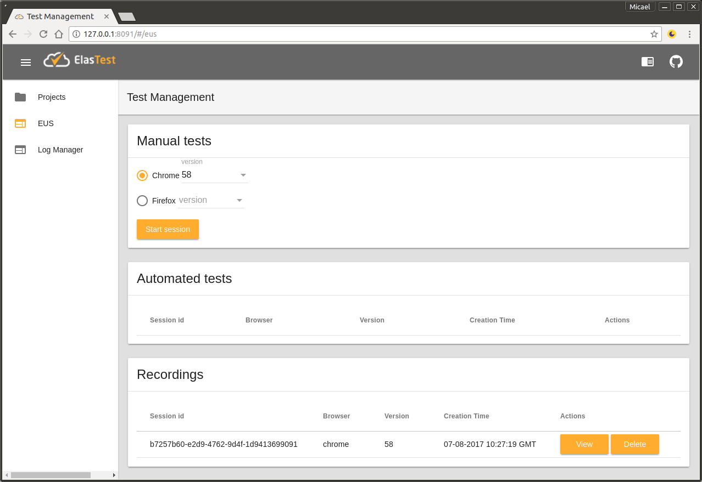

# ElasTest User Emulator Service (EUS)

The ElasTest User-emulator Service (EUS) is an ElasTest service that provides browsers for both manual interaction and automated interacion under the control of tests, by means of starting browsers in containers. To achieve the former, provides a web interface that allows users to interact with the browser; for the later, EUS provides an extension of the [W3C WebDriver](https://www.w3.org/TR/webdriver/) specification, and thus, it can used as server (or hub) for Selenium tests. The main objective is to provide features similar to that of [BrowserStack](https://www.browserstack.com/), or [Saucelabs](https://saucelabs.com/), but integrated with ElasTest platform under an open source license.

## Features
The version 0.1 of the ElasTest User emulator service, provides the following features:

- Start browsers to be controlled manually
- Control browsers automatically using  [W3C WebDriver](https://www.w3.org/TR/webdriver/)
- Browser recording and playing

## How to run

Elastest user emulator service (EUS) is integrated in ElasTest TORM. To execute EUS follow the [instructions to execute ElasTest TORM](https://github.com/elastest/elastest-torm/blob/master/docs/index.md).

## Basic usage

When ElasTest TORM is started, it is accessible in the following URL:
- Linux: http://localhost:8091/ 
- Windows: http://\<docker-host>:8091/ (where \<docker-host> is obtained executing the command `docker-machine ip`) 

EUS web interface is accessible from the option EUS in the sidebar of the main ElasTest TORM web interface.

</p>

### Browsers controlled manually

In the *Manual tests* section you should select the browser type (Chrome or Firefox) and its version. Then, clic in *Start session* button to start a browser.

</p>

When a session is closed, the session is processed and after some time, a new recording is available to be played.

</p>

### Browsers controlled by tests

EUS service can be managed from tests because it offers a WebDriver compatible endpoint. That endpoint has the following URL: 
- Linux: http://localhost:8040/eus/v1 
- Windows: http://\<docker-host>:8040/eus/v1 (where \<docker-host> is obtained executing the command `docker-machine ip`) 

You can use that URL in a Selenium test. For example, if you have a Java maven project with the following dependencies in `pom.xml`:

```xml
<dependency>
   <groupId>junit</groupId>
   <artifactId>junit</artifactId>
   <version>4.12</version>
   <scope>test</scope>
</dependency>
<dependency>
   <groupId>org.seleniumhq.selenium</groupId>
   <artifactId>selenium-remote-driver</artifactId>
   <version>3.4.0</version>
   <scope>test</scope>
</dependency>
```

You can create the following test in `src/test/java` folder

```java
import java.net.MalformedURLException;
import java.net.URL;

import org.junit.After;
import org.junit.Before;
import org.junit.Test;
import org.openqa.selenium.WebDriver;
import org.openqa.selenium.remote.DesiredCapabilities;
import org.openqa.selenium.remote.RemoteWebDriver;


public class RemoteTest {

    private WebDriver driver;

    @Before
    public void setupTest() throws MalformedURLException {     
        driver = new RemoteWebDriver(
            new URL("http://localhost:8040/eus/v1"),
            DesiredCapabilities.chrome()
        );
    }

    @After
    public void teardown() {
        if (driver != null) {
            driver.quit();
        }
    }

    @Test
    public void test() {
        this.driver.get("http://www.google.com");
        String title = this.driver.getTitle();
        System.out.println("Title: "+title);
        assertEquals("Google", title);
    }
}
```

## Development documentation

### Architecture

EUS is implemented in two parts:
* EUS Web client Application
* EUS Server Application

EUS is executed in production integrated in ElasTest TORM. ElasTest is a platform built with services executed as docker containers. Take a look to [Elastest TORM Architecture](https://github.com/elastest/elastest-torm/blob/master/docs/index.md#arquitecture) to know the kind of services available in ElasTest TORM.

#### EUS Web client Application

This application provides de user interface to manage EUS services. It is implemented in Angular and is integrated in ElasTest TORM web application. EUS web client code is located in [the elastest-torm-gui of the ElasTest TORM repository](https://github.com/elastest/elastest-torm/tree/master/elastest-torm-gui).

#### EUS Server Application

This application implements the backend services for EUS. It is implemented in Java using Spring Boot framework and provides a REST and WebSocket API to be used for web client application. It also provides a WebDriver compatible endpoint to be used as remote web driver in tests. 

### Prepare development environment

First, be sure you can execute EUS in production integrated in ElasTest TORM following [this instructions](https://github.com/elastest/elastest-torm/blob/master/docs/index.md#how-to-run).

Then, install the following development tools:
- [Java JDK 8](http://www.oracle.com/technetwork/java/javase/downloads/jdk8-downloads-2133151.html)
- [Maven 3.3.9](https://maven.apache.org/download.cgi)
- [Eclipse IDE](https://eclipse.org/ide/) or similar for Java development.
- [Visual Studio Code](https://code.visualstudio.com/) or similar for Angular development.
- [Angular CLI](https://cli.angular.io/) 

Last, clone the repositories in a local folder:

```
git clone https://github.com/elastest/elastest-user-emulator-service
git clone https://github.com/elastest/elastest-torm
```

### Development procedure

#### EUS Server Application

You can develop EUS Server Application using and editor and the command line or using Eclipse IDE:

* Using *Eclipse IDE*: 
  * Load project in the IDE: 
    * Import *eus* project from local Git Repository using `File > Import... > Maven > Import existing project` option option and select the `elastest-user-emulator-service/eus` folder.
  * Compile and execute the project:
    * Right click over the project and select `Run as..> Java Application` and select `EusSpringBootApp` class.

---
**_Note_**

EUS implements a REST service accessed by HTTP. In addition, it publishes the description of the service in [OpenAPI](https://www.openapis.org/) format in the URL `/eus/v1/api.yaml`. The description of the API is stored in the file [api.yaml](https://github.com/elastest/elastest-user-emulator-service/blob/master/api.yaml) contained in this repository.

In order to avoid the duplicity of this file, we use the `maven-resources-plugin` to copy that file from the root of the repository to the Maven project (located in the [eus](https://github.com/elastest/elastest-user-emulator-service/tree/master/eus) folder). All in all, if you are using Eclipse IDE, you would to invoke this Maven plugin, for example using the command line as follows:

```
cd eus
mvn clean package -DskipTests
```
---

* Using editor and console:
    * Compile and execute the project: 
      * Go to the root directory of the project with `cd elastest-user-emulator-service/eus`
      * Execute command `mvn spring-boot:run`

The server application can be used from the web interface (see next section). The remote webdriver endpoint is located in URL http://localhost:8080/eus/v1.

If you change any source file, you need to stop the service and start it again.

#### EUS Web Client Application

You can develop EUS Web Client Application using and editor and the command line or using Visual Studio Code:

* Using *Visual Studio Code*:
  * Load project in the IDE:
    * Open the project folder using `File > Open folder` option and select the `elastest-torm/elastest-torm-gui`.
    * Open the integrated terminal with `View > Integrated Terminal`
    * Execute `npm install` to download the libraries
  * Compile and execute the project:    
    * Execute `npm start`

* Using editor and console:
  * Prepare the project:
    * Go to the project folder with `cd elastest-torm/elastest-torm-gui`
    * Execute `npm install` to download the libraries
  * Compile and execute the project:    
    * Execute `npm start`

The client application can be used loading the URL http://localhost:4200 in a browser.

If you change any source file, the client will be restarted automatically on save.
